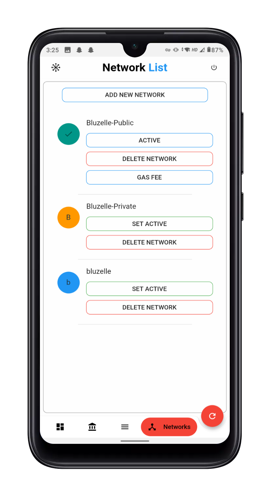

# Project Megacosm
This Flutter based application aims to facilitate the delegation and governance process of any COSMOS based Blockchain network. 
Find apk [here](https://github.com/Abhimanyu121/Megacosm-app/releases).
## Feature List
## App Side Features
1. Mnemonic is stored in encrypted way and user password is not stored at all, so app is really secure.
2. Users can switch between some predefined networks, or add new network.
3. Users can swtich between networks instantly.
### Banking
1. Transfer Tokens to a different account
### Staking
1. Stake tokens to a validator.
2. Withdraw rewards from Validators.
3. Redelegate your stake.
4. Undelegate your stake.
### Governance
1. Creating new text proposals.
2. Adding deposits to the proposals.
3. Voting to a proposal.
### Codebase
1. This application is purely written in dart thus it can run on both iOS and android without changing a single line of code.
2. Clean codebase for easy modeification and usage.

#### NOTE 1:- This application is throughly tested to be running on android as well as iOS without any change in code, but if you face any issues please reach out to me on telegram `@abhimanyu121`
#### NOTE 2:- I tried to impliment all the possible checks, but if you encounter any issues or bugs, please reach out to me.
#### NOTE 3:- You can use this mnemonic if you need funds on this Publice bluzelle testnet `around buzz diagram captain obtain detail salon mango muffin brother morning jeans display attend knife carry green dwarf vendor hungry fan route pumpkin car`
### Video
A lot of new Features are added after this video was made. 
You can watch the small demo video [here](https://drive.google.com/file/d/1v3YkxVCM9DL5dL5tEpPPj2w4auE8qMRw/view?usp=sharing).
### Screenshots
||
||
||
||
- Head over to screenshots folder for more screenshots.

Instructions to build:

https://flutter.dev/docs/get-started/install/macos
https://flutter.dev/docs/deployment/android
https://flutter.dev/docs/deployment/ios

- Be sure to run "pod install" in the ios folder, for a newly installed copy of the code. Then, "open the Runner.xcworkspace" folder. Increment the build number, build an archive, distribute to app store, wait for approval, and then goto AppStoreConnect, and distribute as required.

- For Android, update the "version" in pubspec.yaml in the application folder to a new version (increment, typically). Then, run "flutter build appbundle". Then, goto Google Play Console (https://play.google.com), goto Release Management, App Releases, Manage the Internal Test under "Internal Test Track", click "Create Release" to create a new release, upload the new app bundle created, wait till it completes and then click save at the bottom, then review, then "start rollout to internal test"

- Be sure to also place a key.properties file in the android folder with the following contents:
  storePassword=*******
  keyPassword=*******
  keyAlias=key
  storeFile=/path/to/key.jks
