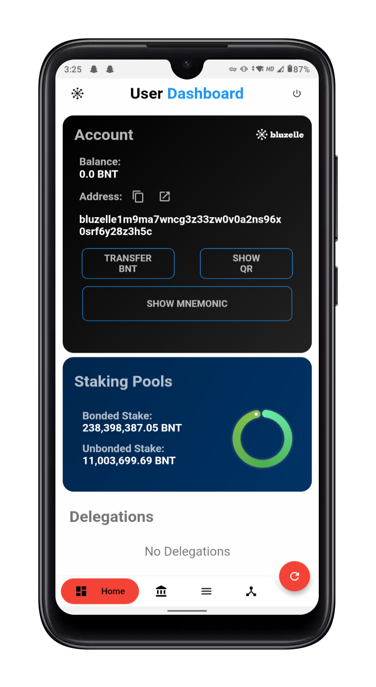

# Project Megacosm
This Flutter based application aims to facilitate the delegation and governance process of Bluzelle's testnet.
## Feature List
### Banking
1. Transfer BNT to a different account
### Staking
1. Stake BNT to a validator.
2. Withdraw rewards from Validators.
3. Redelegate your stake.
4. Undelegate your stake.
### Governance
1. Creating new text proposals.
2. Adding deposits to the proposals.
3. Voting to a proposal.
### Codebase
1. This application is purely written in dart thus it can run on both iOS and android without changing a single line of code.
2. Clean codebase for easy modeification and usage.

#### NOTE 1:- This application is throughly tested to be running on android as well as iOS without any change in code, but if you face any issues please reach out to me on telegram `@abhimanyu121`
#### NOTE 2:- I tried to impliment all the possible checks, but if you encounter any issues or bugs, please reach out to me.
#### NOTE 3:- You can use this mnemonic if you need funds on this private testnet `around buzz diagram captain obtain detail salon mango muffin brother morning jeans display attend knife carry green dwarf vendor hungry fan route pumpkin car`
### Video
You can watch the small demo video [here](https://drive.google.com/file/d/1v3YkxVCM9DL5dL5tEpPPj2w4auE8qMRw/view?usp=sharing).
### Screenshots
||
||
||
- Head over to screenshots folder for more screenshots.
